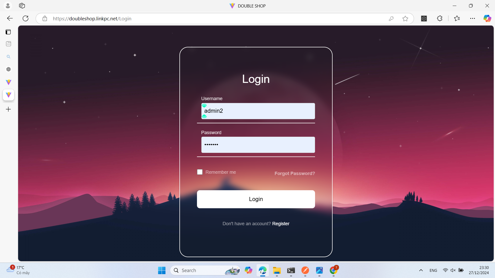
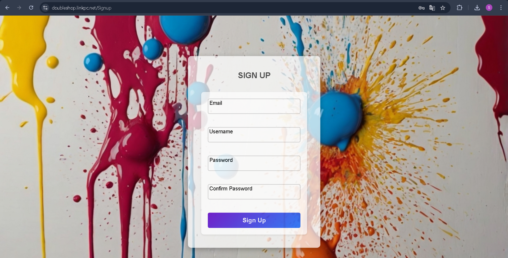
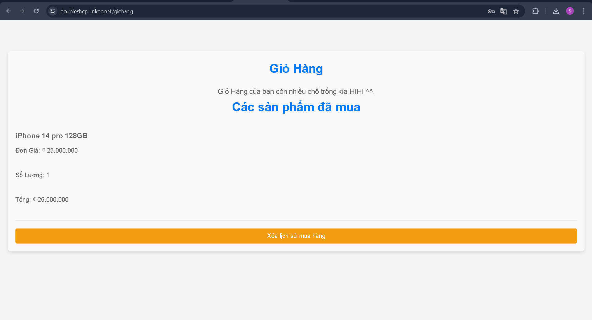
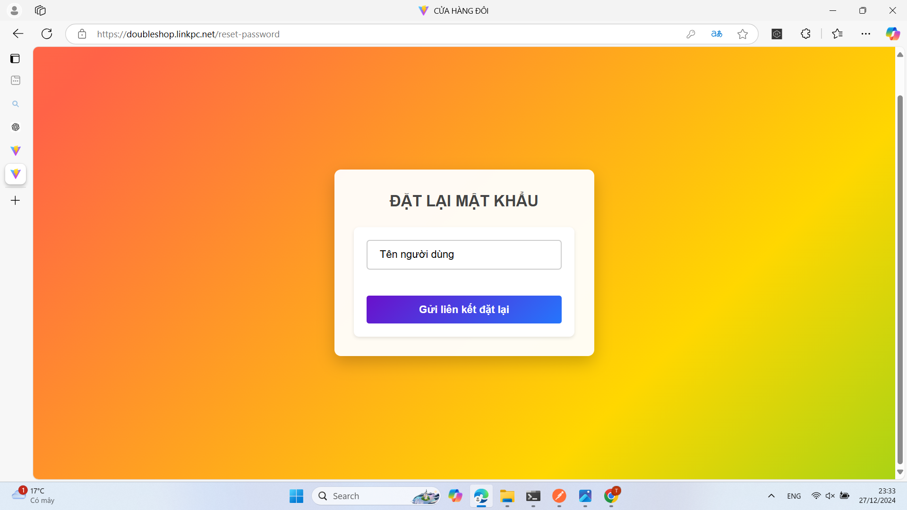
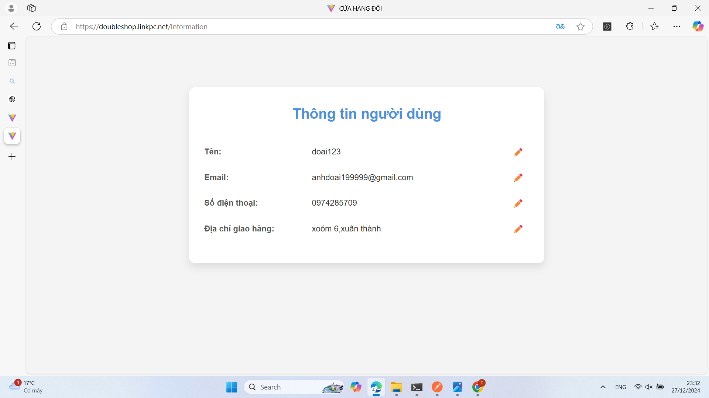
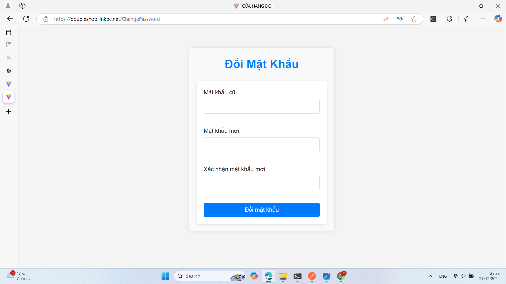
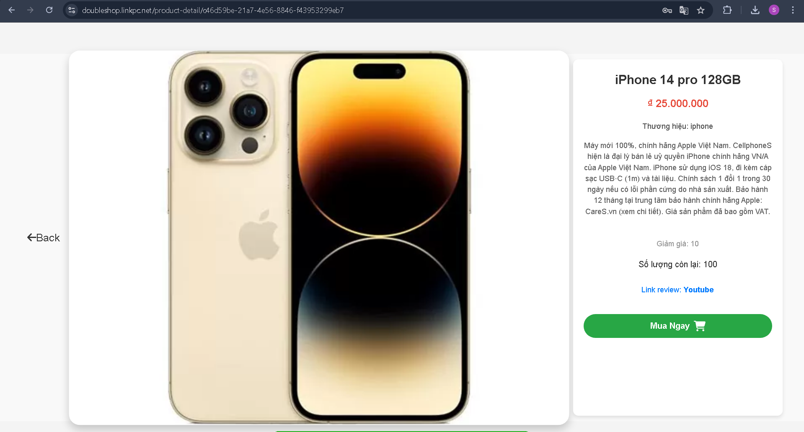
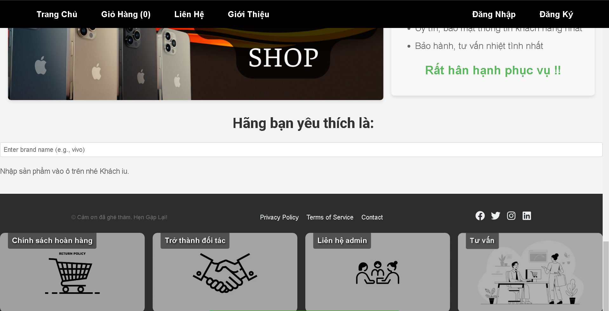
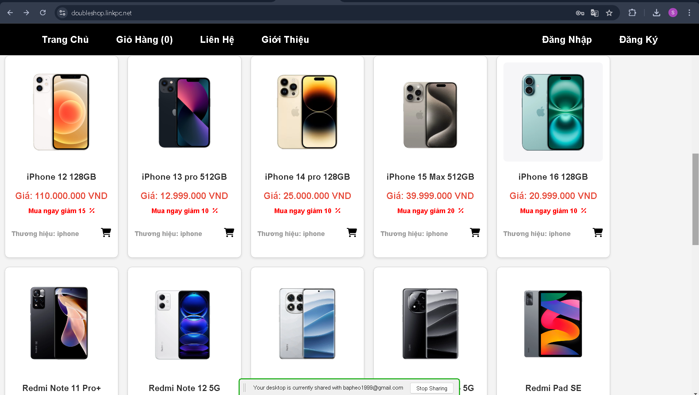

# Bài tập lớn - Phát triển ứng dụng web

## Thông tin sinh viên
- **Họ và tên**: Tống Văn Đoài
- **MSSV**: 2221050785
- **Lớp**: DCCTCT67_04A

## Giới thiệu
Đây là yêu cầu của bài tập lớn cho học phần Phát triển ứng dụng web + BTL (mã học phần 7080116). Sinh viên sẽ xây dựng một ứng dụng web hoàn chỉnh sử dụng một trong các công nghệ sau: NodeJS và Express, .NET, hoặc Web với Dart (**web-only**), Web với Flutter (**multi-platform**) hay một framework tương tự nhằm tăng tốc phát triển. Bài tập lớn này yêu cầu sinh viên áp dụng các kiến thức đã học về lập trình giao diện người dùng, web động theo mô hình Client-Server, tích hợp API hoặc/và CSDL, kiểm thử tự động và CI/CD với GitHub Actions.

## Mục tiêu
Bài tập lớn nhằm:
- Phát triển frontend (UI) cho ứng dụng web động với các công nghệ web truyền thống hoặc hiện đại.
- Hiểu và áp dụng mô hình Client-Server trong phát triển ứng dụng web.
- Biết tích hợp ứng dụng với backend hoặc dịch vụ backend thông qua API hoặc CSDL.
- Thực hiện được các thao tác CRUD (Create, Read, Update, Delete) cơ bản với dữ liệu.
- Biết áp dụng kiểm thử tự động để đảm bảo chất lượng ứng dụng.
- Biết áp dụng CI/CD với GitHub Actions để tự động hóa quy trình kiểm thử và triển khai.

## Yêu cầu ứng dụng
1. **Chức năng CRUD**  
   Ứng dụng phải có khả năng thực hiện các thao tác CRUD cơ bản trên một loại dữ liệu cụ thể (ví dụ: quản lý người dùng, sản phẩm, bài viết, v.v.).

2. **Giao diện người dùng**  
   Ứng dụng phải có giao diện người dùng thân thiện và dễ sử dụng, được xây dựng bằng HTML, CSS và JavaScript (hoặc Dart nếu sử dụng Flutter Web).

3. **Tích hợp API hoặc/và CSDL**  
   Ứng dụng phải tích hợp với một backend hoặc dịch vụ backend thông qua API hoặc/và CSDL. Backend có thể được xây dựng bằng NodeJS và Express, .NET, Web với Dart (**web-only**), Web với Flutter (**multi-platform**) hay một framework tương tự.

4. **Kiểm thử tự động**
Ứng dụng phải có các kiểm thử tự động để đảm bảo chất lượng. Các kiểm thử này có thể bao gồm kiểm thử đơn vị (unit tests), kiểm thử tích hợp (integration tests), và kiểm thử giao diện người dùng (UI tests) tùy theo yêu cầu của ứng dụng và công nghệ sử dụng.

5. **CI/CD với GitHub Actions**
Ứng dụng có thể sử dụng GitHub Actions để tự động hóa quy trình kiểm thử và triển khai.

## Hướng dẫn thực hiện
1. **Xác định yêu cầu ứng dụng**: Xác định chức năng cần thực hiện, thiết kế giao diện người dùng, và xác định công nghệ sử dụng.
2. **Phát triển frontend**: Xây dựng giao diện người dùng với HTML, CSS và JavaScript (hoặc Dart nếu sử dụng Flutter Web).
3. **Phát triển backend**: Xây dựng backend với NodeJS và Express, .NET, Web với Dart (**web-only**), Web với Flutter (**multi-platform**) hoặc một framework tương tự.
4. **Tích hợp frontend và backend**: Tích hợp giao diện người dùng với backend thông qua API hoặc CSDL.
5. **Viết kiểm thử tự động**: Viết các kiểm thử tự động để đảm bảo chất lượng ứng dụng.
6. **Thực thi và gỡ lỗi**: Kiểm thử ứng dụng và sửa lỗi nếu có trên môi trường phát triển.
7. **Thiết lập CI/CD**: Thiết lập GitHub Actions để tự động hóa quy trình kiểm thử và triển khai (không bắt buộc).
8. **Triển khai ứng dụng**: Triển khai ứng dụng lên môi trường sản phẩm để sử dụng (không bắt buộc).

## Tiêu chí đánh giá
- **5/10**: Hoàn thành các chức năng cơ bản của ứng dụng web động, bao gồm giao diện người dùng, server backend với Node.js và Express (hoặc framework khác), và các thao tác CRUD cơ bản.
- **6/10**: Thực hiện kiểm thử đơn vị (unit tests) và kiểm thử tích hợp (integration tests) cho các chức năng chính của ứng dụng.
- **7/10**: Thực hiện kiểm thử End-to-End (E2E) với Cypress và đảm bảo các luồng thao tác chính hoạt động đúng.
- **8/10**: Tích hợp ứng dụng với một CSDL (ví dụ: MongoDB, MySQL) hoặc dịch vụ backend như Firebase để lưu trữ và quản lý dữ liệu.
- **9/10**: Thiết lập CI/CD với GitHub Actions để tự động hóa quy trình kiểm thử và triển khai ứng dụng.
- **10/10**: Báo cáo chi tiết về quá trình phát triển ứng dụng, bao gồm thiết kế, triển khai, kiểm thử và CI/CD. Video demo ứng dụng hoạt động và tài liệu hướng dẫn cài đặt ứng dụng trên thiết bị di động hoặc máy ảo.

## Báo cáo kết quả

Sinh viên viết báo cáo kết quả trực tiếp vào phần này để tránh tạo ra nhiều file báo cáo. Báo cáo cần bao gồm các nội dung sau:

1. **Giới thiệu ứng dụng**: Mô tả ngắn gọn về ứng dụng, mục tiêu và các chức năng chính.
       - Ứng dụng về web bán điện thoại cơ bản
       - Mục tiêu: làm theo mô hình mvc, tập tiếp cận các chức năng cơ bản của ứng dụng 
       - Các chức năng chính: -Restful api, token jws
                              - Lưu trữ sản phẩm, chỉnh sửa sản phẩm
                              - Đăng nhập,đăng kí,forgetpassword,sửa thông tin,đổi mật khẩu
                              -Tìm kiếm
      - domain: https://doubleshop.linkpc.net

2. **Hình ảnh giao diện**: Chèn hình ảnh giao diện chính và các chức năng của ứng dụng. Đảm bảo hình ảnh rõ ràng và mô tả đầy đủ các phần của giao diện.
                        - Ảnh trang chủ: , có header và đăng nhập đăng ký
                        - Ảnh Đăng nhập: , đăng nhập bằng email và password
                        - Ảnh Đăng ký: , đăng ký bằng các tài khoản khách hàng
                        - Ảnh Giỏ hàng: , giỏ hàng chứa trạng thái sản phẩm, gồm các sản phẩm đã mua và chưa mua, xóa sản phẩm
                        - Ảnh quên mk: , gửi mk qua email của người dùng
                        - ảnh thông tin người dùng và chỉnh sửa: ,
                        - ảnh thay đổi mk: ,
                        - Ảnh Sản phẩm: , sản phẩm của cửa hàng
                        - Ảnh Footer: , ảnh footer giao diện ở trang chính, chăm sóc khách hàng, tư vấn, giải đáp thắc mắc,...
                        - Giao diện Sản phẩm Shop: , danh sách sản phẩm
                        

3. **Mô tả chức năng**: Mô tả chi tiết các chức năng của ứng dụng, bao gồm các thao tác CRUD, quản lý trạng thái, tích hợp API hoặc CSDL, kiểm thử tự động và CI/CD.
                       -CRUD(1 số tiêu biểu):  -Đăng nhập: https://doubleshop.linkpc.net/Login
                                               - Đăng kí: https://doubleshop.linkpc.net/Signup
                                               -Lấy sản phẩm theo id (GET): https://doubleshop.linkpc.net/SanPham/{id}
                                               - Thêm sản phẩm (POST) : https://doubleshop.linkpc.net/SanPham
                                               -Chỉnh sửa sản phẩm (PUT) : https://doubleshop.linkpc.net/SanPham/{id}
                                               -Xóa sản phẩm (Delete): https://doubleshop.linkpc.net/SanPham/{id}

                       - quản lí trạng thái: bằng jwt, tạo token để xác thực người dùng
                       - CSDL : tích hợp MYsql, liên kết với spring boot  
                       - Kiểm thử tự động: dùng jest và cypress để kiểm thử 
                       - CI/CD: Git action file deploy.yml dùng để deploy ứng dụng tự động nhanh chóng, File testing.yml để test ứng dụng                  

4. **Video demo (nếu có)**:[]
                     -đường dẫn video :video/gioithieuweb.mp4

5. **Tự đánh giá điểm**: Sinh viên tự đánh giá điểm của mình theo tiêu chí đánh giá đã đề ra. Ghi rõ điểm tự đánh giá và lý do.

        - Điểm: 10/10
        -Lý do: - hoàn thiện tất cả các tiêu chí đề ra
                - Thêm tính năng :
                + xác thực người dùng bằng jwt
                + Triển khai server nginx (https)
                + domain
                + Triển khai docker để quản lý toàn bộ ứng dụng (portainer) và deploy một cách dễ dàng

## Yêu cầu nộp bài
- **Source code**: Sinh viên cần nhận bài tập từ GitHub Classroom và nộp mã nguồn của ứng dụng theo đúng cấu trúc yêu cầu.
- **Gỡ lỗi ứng dụng**: Sinh viên cần chắc chắn ứng dụng hoạt động đúng trên máy tính cá nhân trước khi nộp bài.
- **Kiểm thử tự động**: Sinh viên cần thiết lập kiểm thử tự động để đảm bảo chất lượng ứng dụng. Mã nguồn của kiểm thử cần được đặt trong thư mục `tests`.
- **Thiết kế giao diện**: Thiết kế giao diện người dùng cho ứng dụng, đảm bảo tính thân thiện và dễ sử dụng.
- **Phát triển backend**: Xây dựng backend cho ứng dụng, bao gồm các API cần thiết để thực hiện các thao tác CRUD với dữ liệu thông qua **CSDL hoặc dịch vụ backend như Firebase**.

- **Tích hợp frontend và backend**: Tích hợp giao diện người dùng với backend thông qua các API.
- **Thiết lập CI/CD**: Thiết lập GitHub Actions để tự động hóa quy trình kiểm thử và triển khai.

